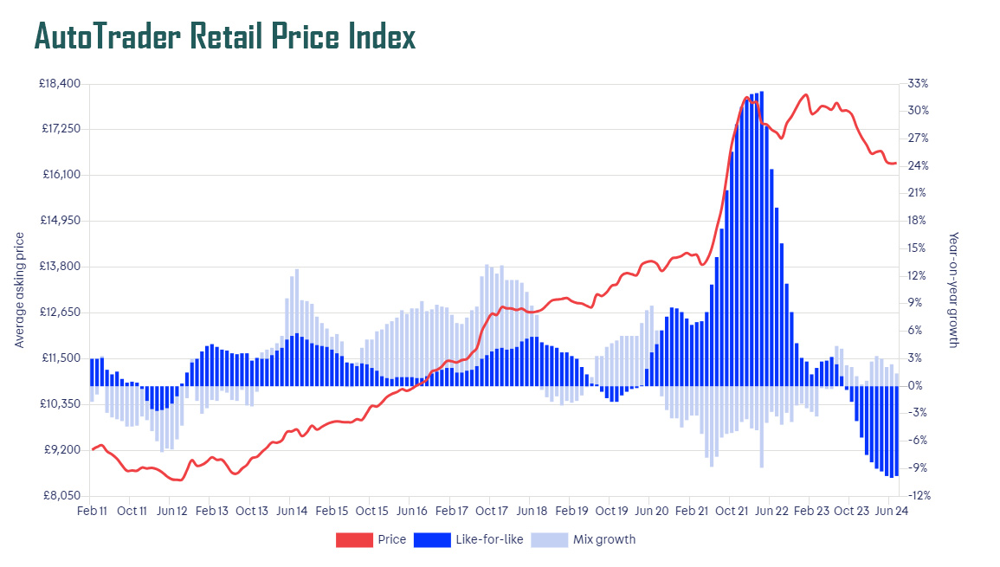

# Predictive-Analytics-for-UK-Car-Prices-using-Machine-Learning


## 1. Introduction
This project focuses on predictive analytics for UK car prices using machine learning techniques. It provides insights into the used car market, which has seen significant growth, particularly due to the rise of electric vehicles (EVs) and changing consumer preferences. With a vast number of secondhand cars being sold through various platforms, including private listings and dealerships, predicting the selling price is critical for both buyers and sellers. This project aims to leverage machine learning to predict used car prices based on multiple features such as mileage, fuel type, transmission, and engine size.

<p align="center"> 
<p>
<div style="text-align:center;">
    
</div>

## 2. Background & Literature Review
The UK used car market is projected to grow significantly, reaching USD 226.16 billion by 2027 with a robust 11.5% annual growth rate. This growth is driven by the increasing demand for electric vehicles, technological advancements, and changes in market dynamics. 

This study employs datasets available on Kaggle, including data from well-known car manufacturers such as Audi, BMW, Ford, Toyota, Volkswagen, and Hyundai. The dataset has been cleaned and contains over 72,000 entries with information on vehicle prices, mileage, fuel type, and other relevant details. By leveraging machine learning models like Decision Trees, Random Forest, Gradient Boosting, and Support Vector Machines (SVM), we aim to build a robust predictive model for used car prices.

## 3. Datasets
The datasets used in this project are publicly available on Kaggle:
- **Sources**: Awais Tayyab, Ashwarya Mathulumar, and Gerrit Hoekstra
- **Features**: The dataset consists of 72,435 rows and 10 columns, with key features like:
  - Vehicle price
  - Transmission type (manual, automatic)
  - Mileage
  - Fuel type (petrol, diesel, electric)
  - Engine size
  - Year of manufacture

## 4. Installation and Setup

### Prerequisites
To run this project, you'll need the following libraries installed in your Python environment:
- `numpy`
- `pandas`
- `matplotlib`
- `seaborn`
- `sklearn`

### Installation
You can install the required libraries using the following command:


pip install numpy pandas matplotlib seaborn scikit-learn

## 5. Installation and Setup
Clone the repository and navigate to the project directory:

git clone https://github.com/your-username/UK-Car-Price-Prediction.git
cd UK-Car-Price-Prediction

Place the dataset files (CSV format) inside the Data folder.

Run the Jupyter notebook or Python script to load, clean, and process the dataset, visualize trends, and train machine learning models.

The project uses various machine learning models for prediction, including:

Decision Tree Regressor
Random Forest Regressor
Gradient Boosting Regressor
Linear Regression
Support Vector Machine (SVM)
Model results are evaluated using metrics such as:

Mean Absolute Error (MAE)
Mean Squared Error (MSE)
Root Mean Squared Error (RMSE)
R-squared score (R²)

## 6. Project Structure
The project is structured as follows:
├── Data                    # Folder containing the datasets
├── README.md                # Project documentation
├── Car_Price_Prediction.ipynb # Jupyter notebook for data analysis and model training
└── src                      # Source files for data processing and model functions

## 7. Results and Visualization
Data Cleaning: Removed outliers, dealt with missing values, and performed data encoding.
Data Visualization: Provided insights into car price trends over time, engine size distributions, and company-specific car price comparisons.
Model Performance: The Gradient Boosting Regressor and Random Forest Regressor showed the best performance in terms of RMSE and R² score.

## 8. Conclusion
Predicting car prices with machine learning can provide valuable insights into the UK used car market. This project demonstrated how multiple regression models could be employed to predict car prices with a focus on improving accuracy. The results from models like Gradient Boosting and Random Forest were promising, with strong R² scores indicating good fit.

## 9. References
UK Used Car Market Trends [1]: https://www.statista.com/study/uk-used-car-market/
Datasets used from Kaggle: https://www.kaggle.com/datasets

## 10. License
This project is licensed under the MIT License. See the LICENSE file for more details.

This file provides a clear summary of your project, including an overview, data description, installation steps, project structure, and insights from the results.


```bash
